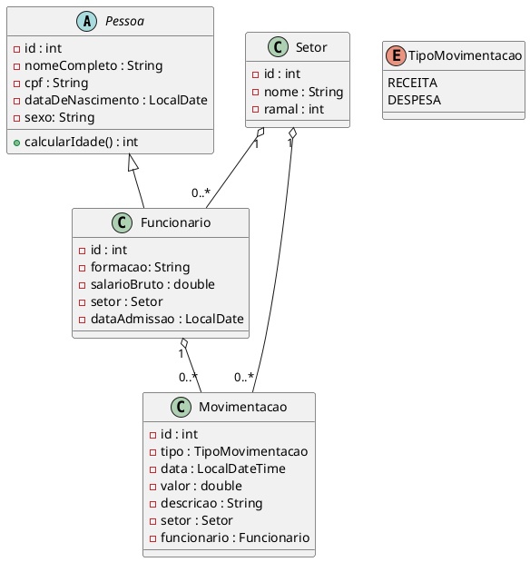

# Sistema de RH - POO II

Trabalho desenvolvido por:
- Guilherme Gomes de Oliveira  
- Leonardo Dumes de Souza  

---

## Diagrama UML

```plantuml
@startuml

abstract class Pessoa {
    - id : int
    - nomeCompleto : String
    - cpf : String
    - dataDeNascimento : LocalDate
    - sexo: String
    + calcularIdade() : int

}

class Funcionario {
    - id : int
    - formacao: String
    - salarioBruto : double
    - setor : Setor
    - dataAdmissao : LocalDate
}

class Setor {
    - id : int
    - nome : String
    - ramal : int
}

class Movimentacao {
    - id : int
    - tipo : TipoMovimentacao
    - data : LocalDateTime
    - valor : double
    - descricao : String
    - setor : Setor
    - funcionario : Funcionario
}

enum TipoMovimentacao {
    RECEITA
    DESPESA
}


Pessoa <|-- Funcionario

Setor "1" o-- "0..*" Funcionario 
Setor "1" o-- "0..*" Movimentacao 
Funcionario "1" o-- "0..*" Movimentacao 

@enduml
```

---
